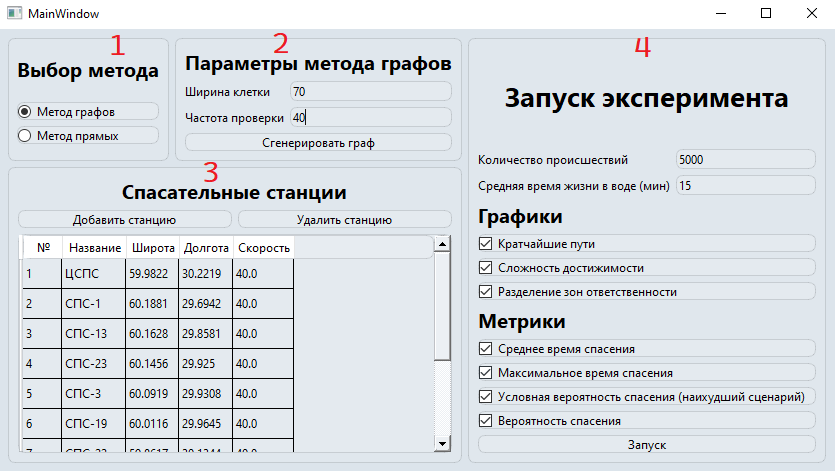
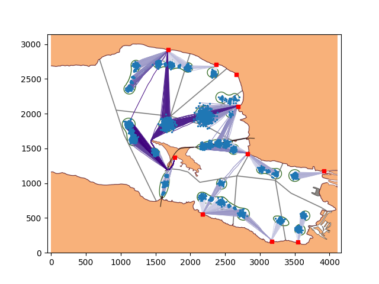
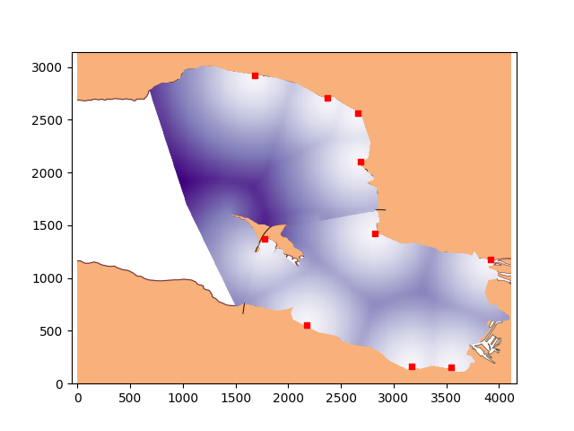
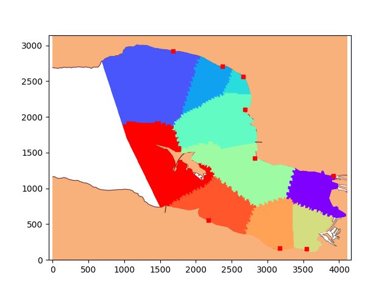

# Rescue Operations Simulation Program

Rescue Operations Simulation Program is a part of the undergraduate thesis project developed by **Mikhail Preobrazhensky** to simulate maritime/coastal emergency scenarios. The program is implemented in Python 3 using various libraries and features a graphical user interface built with **PyQt6**. 

The simulation is demonstrated using the Finnish Gulf as an example and was developed in close cooperation with Saint Petersburg rescue services, who provided critical information for the project.

This README provides a complete guide on installation, configuration, usage, and a detailed description of the program features along with graphical examples.

---

## Table of Contents

- [Overview](#overview)
- [Features](#features)
- [Usage](#usage)
  - [Launching the Program](#launching-the-program)
- [Graphical User Interface](#graphical-user-interface)
- [Graphs and Images](#graphs-and-images)
- [Contributing](#contributing)
- [License](#license)
- [Contact](#contact)

---

## Overview

The program simulates rescue operations by computing the optimal routes from rescue stations to emergency sites. Two methods are provided:
- **Direct Method:** A fast but approximate method tailored for the Finnish Gulf.
- **Graph Method:** A more precise and resource-intensive method using Dijkstra’s algorithm with spatial discretization. It allows adjustments (e.g., cell width and land intersection checks) to fine-tune accuracy.

The simulation utilizes the Finnish Gulf as the operational area and was developed in close cooperation with Saint Petersburg rescue services, which provided essential data and expertise to refine the model.

The software also features Monte Carlo simulations to estimate emergency response times and survival probabilities.

---

## Features

- **Easy Setup:**  
  Step-by-step installation instructions for Python, pip, and setting up a dedicated project directory.
- **Automated Batch Setup:**  
  A convenient `run_program.bat` script that sets up the virtual environment, installs dependencies, and launches the program.  
  *Note:* The first run may take up to 5 minutes. If nothing happens after 5 minutes, try running the batch file with administrator privileges. Antivirus software (e.g., Kaspersky) might need special configuration.
- **Flexible Simulation Methods:**  
  Choose between a quick Direct Method or a more detailed Graph Method for calculating rescue routes.
- **Rescue Station Management:**  
  Easily add or remove rescue stations through graphical dialog boxes, with support for both decimal and DMS coordinate formats.
- **Graphical Visualization:**  
  Provides three types of visual outputs:
  - **Shortest Paths Graph:** Displays optimal rescue routes.
  - **Reachability Heatmap:** A color-coded map indicating areas with longer access times.
  - **Responsibility Zone Distribution:** Highlights the coverage zones of individual rescue stations.
- **Parameter Optimization:**  
  Graph Method parameters (such as cell width and frequency of land intersection checks) can be adjusted to balance precision and computation time.
- **Experiment Setup:**  
  Configure the number of emergency incidents (recommended minimum: 2000 points for a reasonable balance between simulation speed and accuracy) and the average time individuals remain in water.


---

## Usage 
**Launching the Program**

To run the application, use the following command:

    ```
    bash
    python main.py
    ```
Alternatively, you can use the provided batch file run_program.bat, which will:

1. Navigate to the project directory.

2. Check for the presence of requirements.txt.

3. Create and activate the virtual environment if it does not exist.

4. Install all necessary libraries.

5. Launch the program.

6. Deactivate the virtual environment after the program finishes.

---

## Graphical User Interface 

Once launched, the program displays a user interface with four main sections:


### 1. Method Selection:

Choose between the Direct Method and the Graph Method.

  - Direct Method: Fast but less precise.

  - Graph Method: More accurate but computationally demanding.

### 2. Graph Method Parameters:

When using the Graph Method, adjust:

- Cell Width: Default is 70 pixels. Acceptable range: [20, 100]. Lower values increase precision at the cost of speed.

- Land Intersection Check Frequency: Adjust this if trajectories seem to improperly cross land masses.

### 3. Rescue Stations Management:

Add or remove rescue stations using the dialog boxes provided.

- Adding a Station:
Click the "Add Station" button to enter the new station details (supports both decimal and DMS formats).

- Removing a Station:
Select the station(s) from the list and click the "Remove Station" button.

### 4. Experiment Configuration:

Set parameters such as the number of incidents and the average time in water. Then launch the simulation to generate the graphs.

## Graphs and images
Below are examples of the graphs generated by the program:

### 1. Shortest Paths Graph
The graph displays optimal rescue routes, emergency incident points, and the positions of rescue stations.



### 2. Reachability Heatmap
This heatmap indicates the difficulty of reaching different areas on the map—darker areas signify longer access times.



### 3. Responsibility Zones Graph
This graph shows the coverage zones of each rescue station using a spectrum of colors where each color represents the fastest responding station within that zone.

